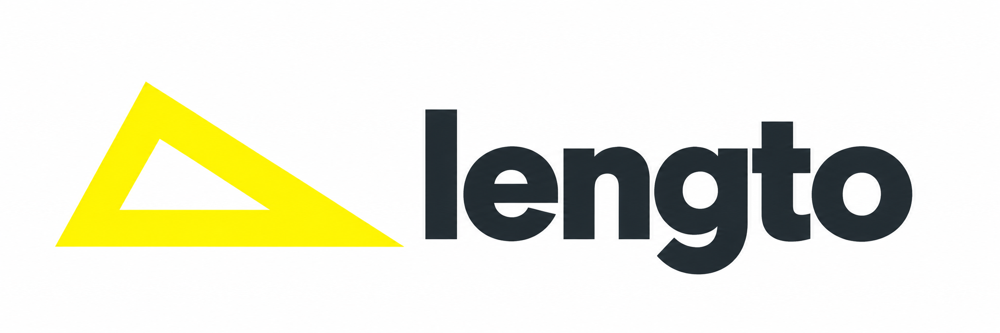
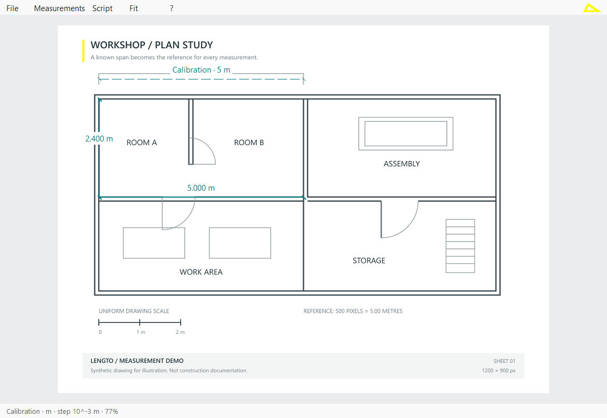
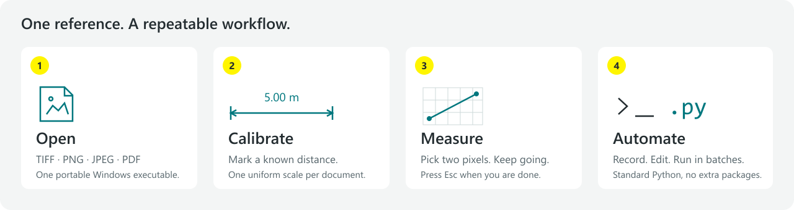
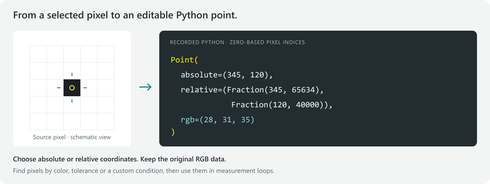

  

<h1 align="center">Turn pixels into measurements.</h1>

Open an image. Set the scale. Measure.

  <a href="https://github.com/IvanPanzera/lengto/releases/latest/download/lengto.exe"><strong>Windows</strong></a> ·
  <a href="https://github.com/IvanPanzera/lengto/releases/download/v0.7.0-preview.1/lengto-linux-x86_64.AppImage"><strong>Linux</strong></a> ·
  <a href="https://github.com/IvanPanzera/lengto/releases/download/v0.7.0-preview.1/lengto-macos-universal.zip"><strong>macOS</strong></a> ·
  <a href="docs/USER_GUIDE.md">Quick guide</a> ·
  <a href="docs/PYTHON_EXAMPLES.md">Python examples</a>

<strong>Windows · Linux · macOS · Portable · No installer</strong>

**lengto** measures real distances on scanned plans, technical photographs and microscope images. All you need is a known reference length. Use a single EXE on Windows, an AppImage on Linux, or an app bundle on macOS.

*Application render using a synthetic drawing.*

## Download and run

| System | Download | First start |
|---|---|---|
| Windows 10/11, x64 | [lengto.exe](https://github.com/IvanPanzera/lengto/releases/latest/download/lengto.exe) | Double-click. No installation. |
| Linux, x86_64 | [AppImage](https://github.com/IvanPanzera/lengto/releases/download/v0.7.0-preview.1/lengto-linux-x86_64.AppImage) | Allow execution in the file properties, then double-click. |
| macOS 11+, Intel and Apple Silicon | [Universal app ZIP](https://github.com/IvanPanzera/lengto/releases/download/v0.7.0-preview.1/lengto-macos-universal.zip) | Extract and open `lengto.app`; moving it to Applications is optional. |

Linux and macOS are **preview builds**, tested automatically on Ubuntu and both Mac architectures. On macOS, the app is ad-hoc signed and is not notarized; the first launch may require **System Settings → Privacy & Security → Open Anyway**. On Linux without FUSE, use `./lengto-linux-x86_64.AppImage --appimage-extract-and-run`.

[Setup details and optional Python support →](docs/INSTALLATION.md)

## Small tool. Useful capabilities.

- **Open or paste.** TIFF, PNG, JPEG and PDF, including multipage documents. Paste images with **Ctrl+V** (**Command+V** on macOS).
- **Calibrate and measure.** Pixel snapping, flexible units and editable measurement labels.
- **Save the result.** Export annotated images or PDFs; include all pages in TIFF/PDF.
- **Repeat the work.** Record editable Python macros and apply them to other images or whole folders.

## Start in three steps

1. [Choose the package for your system](docs/INSTALLATION.md), then open, drop or paste an image.
2. Choose **Measurements → Calibrate**, enter a known length and click its endpoints.
3. Choose **Measure**, click endpoint pairs, then **File → Export** to save. **Esc** ends the tool.

[Quick guide →](docs/USER_GUIDE.md)

## From pixels to Python

Every recorded point keeps its **pixel coordinates, relative position and source color**. Edit the macro to find colored features, repeat measurements or process a folder. Relative coordinates adapt to resized images with matching framing; RGB searches let your script choose new endpoints.

Python 3.8+ is needed only to **run macros**. Measuring and recording need nothing extra.

[Explore the Python examples →](docs/PYTHON_EXAMPLES.md)

**Know the limits:** one uniform scale per document; no perspective correction. Exports flatten annotations and use preview resolution. Keep the source and a macro to reproduce your work.

[Build from source](DEVELOPMENT.md) · [Releases](https://github.com/IvanPanzera/lengto/releases) · [Report a problem](https://github.com/IvanPanzera/lengto/issues)

[MIT license](LICENSE) · © 2026 Ivan Panzera. Bundled components retain their [own licenses](third_party).
